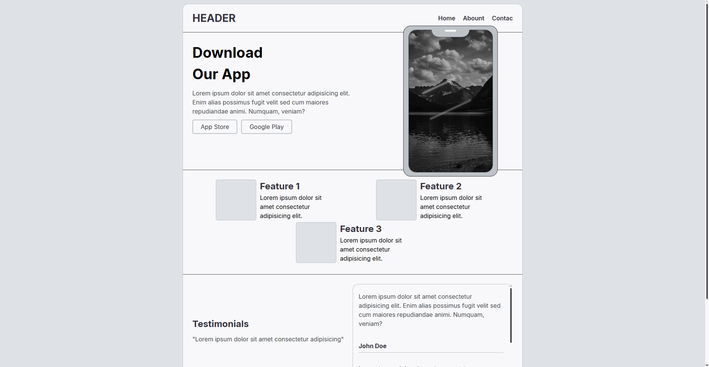

# App-Movil

Landing page para promocionar una aplicación móvil. Este proyecto incluye una estructura básica de HTML y CSS para mostrar las características principales de la aplicación, testimonios de usuarios y enlaces de descarga para App Store y Google Play.

## Estructura del Proyecto

-   **index.html**: Archivo principal que contiene la estructura HTML de la landing page.
-   **/css/style.css**: Archivo CSS para los estilos de la página.
-   **/image/preview.png**: Imagen de vista previa utilizada para las etiquetas de Open Graph y Twitter Card.

## Características

-   Diseño responsivo.
-   Sección de características destacadas.
-   Testimonios de usuarios.
-   Enlaces de descarga para App Store y Google Play.
-   Integración con redes sociales mediante etiquetas Open Graph y Twitter Card.

## Cómo Usar

1. Clona este repositorio.
2. Abre el archivo `index.html` en tu navegador.
3. Personaliza el contenido según tus necesidades.

## Vista Previa

## Autor

Creado por **c0d3hdz**.

## Licencia

Este proyecto está bajo la licencia MIT. Consulta el archivo LICENSE para más detalles.
